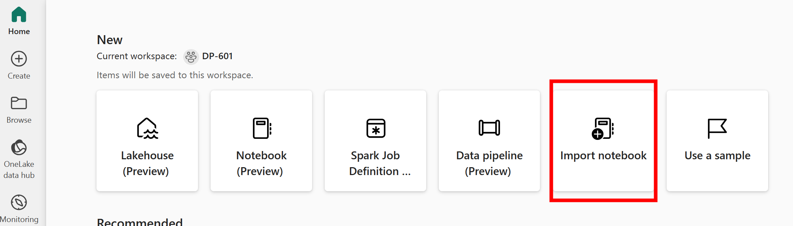

# DP-601 Resources

Create a DP-601 Workspace with the Fabric Trial Capacity

```powershell
Install-Module -Name MicrosoftPowerBIMgmt
Connect-PowerBIServiceAccount

$workspace = New-PowerBIWorkspace -Name "DP-601"
Set-PowerBIWorkspace -Scope Organization -Id $workspace.Id -Description "Course DP-601: Implementing a Lakehouse with Microsoft Fabric" 
Set-PowerBIWorkspace -Scope Organization -Id $workspace.Id -CapacityId 8774B796-23F5-4833-A18B-5FC6F2026E66 # Fabric Trial Capacity
```

## Create a lakehouse

Create a new lakehouse called `dp601lake`

## Upload sample data

```powershell

Install-Module Az.Storage -Repository PSGallery -Force
Connect-AzAccount

$ctx = New-AzStorageContext -StorageAccountName 'onelake' -UseConnectedAccount -endpoint 'fabric.microsoft.com' 
$workspaceName = 'DP-601'
$filesystemName = 'dp601lake.lakehouse/Files'
New-AzDataLakeGen2Item -Context $ctx -FileSystem $filesystemName -Path "sampledata" -Directory

# Recursively get the length of all files within your lakehouse, sum, and convert to GB.
$colitems = Get-AzDataLakeGen2ChildItem -Context $ctx -FileSystem $workspaceName -Path $itemPath -Recurse -FetchProperty | Measure-Object -property Length -sum
"Total file size: " + ($colitems.sum / 1GB) + " GB"
```

## Upload notebooks

1. Navigate to https://app.fabric.microsoft.com/home?experience=data-engineering, make sure you're in the correct workspace and click on Import notebook. (There is currenly no API/PowerShell command available to automate this).



1. Import the notebooks from the `notebooks` folder (you can select multiple files at once 😉)
